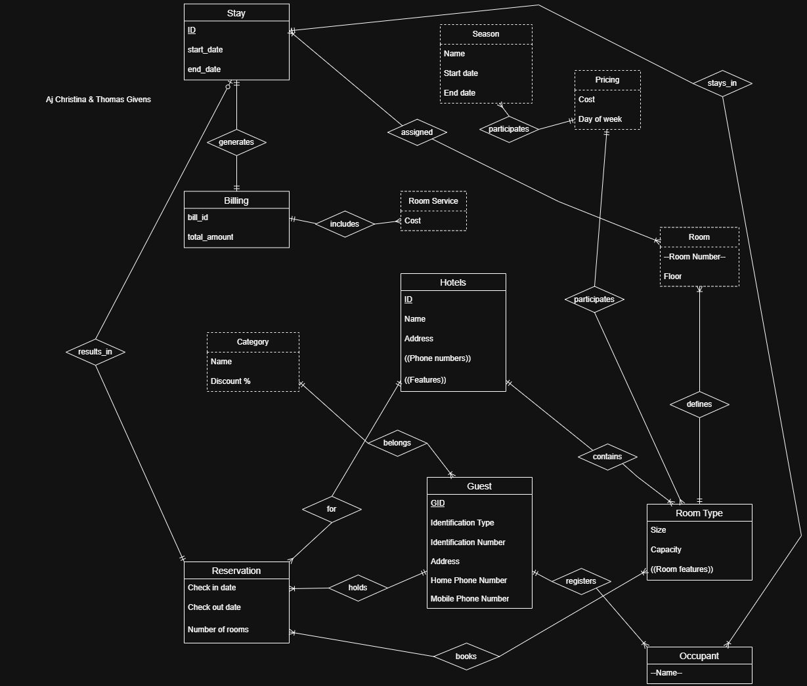
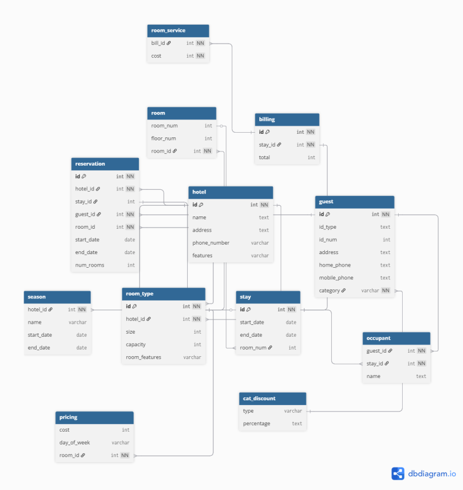
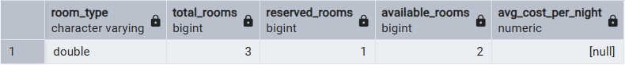
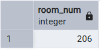
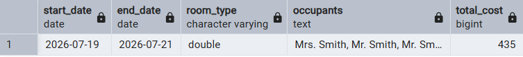
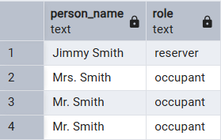
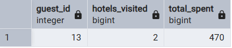

# CS374 Hotel Database Final Report
*Thomas Givens & Aj Christina*

## ER Model
*insert the image here*

*describe any changes since HW7*
We made all weak entities have an identifying relationship. We added id's to the tables that didn't have them. We changed occupants to be a weak entity connected to guest. We made it so season connected to the hotel.

## Relational Model
*insert the image(s) here*

- Hotel relational model: 

*Describe any changes since HW7*
We had to change the relational model to match the new eer model.

## Database creation
*Link the files here*

- Drop tables: [hw7_create_no_fk.sql](./database/hw7_create_no_fk.sql)
- Create tables: [hw7_create_no_fk.sql](./database/hw7_create_no_fk.sql)
- Add constraints to tables: [hw7_add_fk.sql](./database/hw7_add_fk.sql)
- Insert data: [hw7_update.sql](./database/hw7_update.sql)

*They should be in a subdirectory called database*

*Describe any changes very briefly: for example:*

We had to add extra data to be inserted into the tables.

## Queries

### Query 1
*Link the code file(s) here from subdirectory queries*
- [hw8_queries.sql](./queries/hw8_queries.sql)

*Describe the queries in detail with screenshots of the data setup and the results*
We get all the available rooms and room types for hotel A for the requested dates. We get the price of the rooms for each night of the stay. We make sure to add the vip discount to the billing. We then reserve on of the rooms for the guest and add their stay to the hotel.

### Query 2
*Link the code file(s) here from subdirectory queries*
- [hw8_queries.sql](./queries/hw8_queries.sql)

*Describe the queries in detail with screenshots of setup and results*
Checks for available double rooms in hotel B. We then assign the room to the guests and occupants.

### Query 3
*Link the code file(s) here from subdirectory queries*
- [hw8_queries.sql](./queries/hw8_queries.sql)

*Describe the queries in detail with screenshots of setup and results*
First we check the guests out of their room. Then we get their stay information. After we produce the stays dates, room type, occupants, and the total bill of the stay.

### Query 4
*Link the code file(s) here from subdirectory queries*
- [hw8_queries.sql](./queries/hw8_queries.sql)

*Describe the queries in detail with screenshots of setup and results*
We find the names of the guests reserving a specific room on a specific date. It also finds the occupants staying in the room.

### Query 5
*Link the code file(s) here from subdirectory queries*
- [hw8_queries.sql](./queries/hw8_queries.sql)

*Describe the queries in detail with screenshots of setup and results*
It starts by finding guest 13 from the guest table and joins it to the reservation table so it can find reservations made by that guest. We count how many different hotels the guest has stayed at and get their bill. The query only returns guests if they have stayed at 2 or more different hotels.
