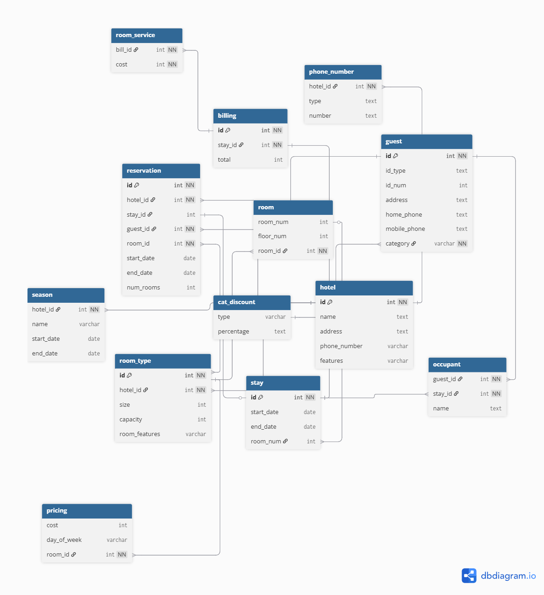
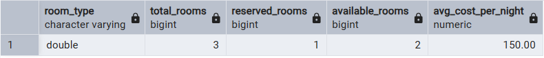

# CS374 Hotel Database Final Report
*Thomas Givens & Aj Christina*

## ER Model
*insert the image here*

*describe any changes since HW7*
We made all weak entities have an identifying relationship. We added id's to the tables that didn't have them. We changed occupants to be a weak entity connected to guest. We made it so season connected to the hotel.

## Relational Model
*insert the image(s) here*

- Hotel relational model: 

*Describe any changes since HW7*
Removed unnecessary connectors that don’t represent the true relationships (ie. stay having a hotel_id FK when in reality it is entirely unnecessary)

Also added new connectors where necessary (ie. reservation having a link to room type through the room types new primary key)

## Database creation
*Link the files here*

- Drop tables: [hw7_create_no_fk.sql](./database/hw7_create_no_fk.sql)
- Create tables: [hw7_create_no_fk.sql](./database/hw7_create_no_fk.sql)
- Add constraints to tables: [hw7_add_fk.sql](./database/hw7_add_fk.sql)
- Insert data: [hw7_update.sql](./database/hw7_update.sql)

*They should be in a subdirectory called database*

*Describe any changes very briefly: for example:*

We had to add extra data to be inserted into the tables.

## Data
Data updates made for the queries:
- We added a vip guest and a vip discount category so that pricing can be discounted based off the category.
- We created overlapping stays so that room availability can be shown and tested.
- We also inserted room service charges to the billing to demonstrate final bill amounts.
- We also had to make a guest stay at multiple hotels to show the total spent query. 

## Queries

### Query 1
*Link the code file(s) here from subdirectory queries*
- [hw8_queries.sql](./queries/hw8_queries.sql)

*Describe the queries in detail with screenshots of the data setup and the results*
This query finds available rooms for hotel A over the selected stay dates (July 15–16, 2026). It builds a date range for the requested period, identifies the correct season for hotel 1, and then calculates nightly prices by weekday using the `pricing` table. It also summarizes room inventory by type and subtracts rooms already reserved for overlapping dates. The result shows available room types, total rooms, reserved rooms, and the number of rooms remaining. The query applies the VIP discount from `cat_discount` to compute an adjusted average cost per night for the guest. After the availability logic, it begins a transaction and inserts a new VIP guest, a new stay, and a reservation, demonstrating how the system moves from search to booking.

### Query 2
*Link the code file(s) here from subdirectory queries*
- [hw8_queries.sql](./queries/hw8_queries.sql)

*Describe the queries in detail with screenshots of setup and results*
This query finds an available double room in hotel B for July 19, 2026. It joins `room` and `room_type` to identify hotel B double rooms, then filters out any room that has a conflicting stay on that date using `NOT EXISTS` against the `stay` table. Once an available room is found, the script updates stay ID 11 to assign room 205 and inserts an occupant record for Mr. Smith. This shows the reservation system assigning a physical room and tracking the people staying there.

### Query 3
*Link the code file(s) here from subdirectory queries*
- [hw8_queries.sql](./queries/hw8_queries.sql)

*Describe the queries in detail with screenshots of setup and results*
This query handles checkout and billing for stay ID 11. It inserts a billing record, adds a room service charge, and then clears the room assignment by setting `room_num` to `NULL`. The final SELECT returns the stay date range, the reserved room type, all occupant names, and the total cost. The total cost is calculated by adding the billing total and any room service charges, which confirms the database can produce a complete invoice for a stay.

### Query 4
*Link the code file(s) here from subdirectory queries*
- [hw8_queries.sql](./queries/hw8_queries.sql)

*Describe the queries in detail with screenshots of setup and results*
This query retrieves the reservation and occupancy details for a specific room and date: hotel B room 205 on July 20, 2026. It finds the relevant stay, then returns the reserver’s name and any occupant names for that stay. The result uses a `UNION ALL` to separate the primary reserver role from occupants, showing how the schema supports both the booking party and the people actually staying in the room.

### Query 5
*Link the code file(s) here from subdirectory queries*
- [hw8_queries.sql](./queries/hw8_queries.sql)

*Describe the queries in detail with screenshots of setup and results*
This query reports spending for guest ID 13 during 2026. It joins `guest`, `reservation`, and `billing`, and left-joins `room_service` to include optional service charges. It calculates how many distinct hotels the guest has visited and sums the total spent across reservations. The query then filters so it only returns results for guests who stayed in at least two different hotels, demonstrating multi-hotel reporting.

